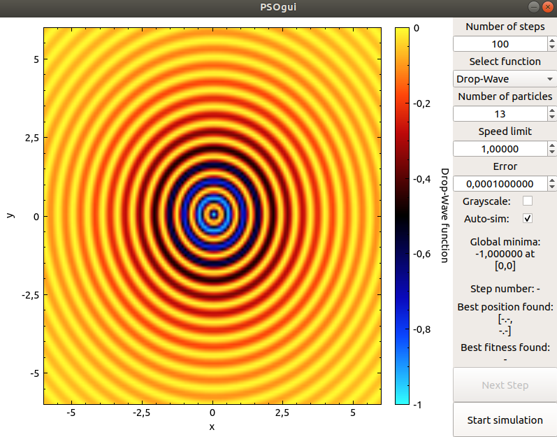

# Particle swarm optimization algorithm visualisation 
This project serves as visualisation tool for particle swarm optimization algorithm. Project implements multiple functions that can be used to visualise how particles move in order to find a global minima of the function. 
[SPSO 2006](https://hal.archives-ouvertes.fr/hal-00764996/document) version of PSO algorithm is implemented in this tool. Qt Library [QCustomPlot](https://www.qcustomplot.com/) is used for plotting graphs.

## Usage
Picture of gui:

You can set: 
* maximum number of steps that this app will simulate - simulation will end after finding value with deviation from global minima less than set error, or after reaching maximum number of steps,
* function for optimization,
* number of particles,
* speed limit - maximum distance that a particle can move in single step, some functions have smaller area so speed should be adjusted so particles don't move to fast,
* error - simulation end condition, when best values deviation from optimal value is less than error value simulation will end
* auto and manual simulation - when auto-sim checkbox is checked app will automatically simulate all steps at once, when not checked, user can manually go through all steps using next step button


## Functions for optimization

| Name |  Global minima value | Global minima position  |  range X | range Y  |
|:--:|:---:|:---:|:---:|:---:|
| [Ackley](https://www.sfu.ca/~ssurjano/ackley.html) |  0.0 | \[0,0\]  | \<-40,40\>  |  \<-40,40\> |
| [Bukin N.6](https://www.sfu.ca/~ssurjano/bukin6.html) |  0.0 | \[-10,1\]  | \<-51,51\>  |  \<-3,3\> |
| [Cross In Tray](https://www.sfu.ca/~ssurjano/crossit.html) |  -2.06261 | \[+-1.13491,+-1.13491\]  | \<-10,10\>  |  \<-10,10\> |
| [Drop Wave](https://www.sfu.ca/~ssurjano/drop.html) |  -1 | \[0,0\]  | \<-6,6\>  |  \<-6,6\> |
| [Easom](https://www.sfu.ca/~ssurjano/easom) |  -1 | \[Pi,Pi\]  | \<-80,80\>  |  \<-80,80\> |
| [Griewank](https://www.sfu.ca/~ssurjano/griewank.html) |  0 | \[0,0\]  | \<-100,100\>  |  \<-100,100\> |
| [Holder Table](https://www.sfu.ca/~ssurjano/holder.html) |  -19.2085 | \[+-8.05502,+-8.05502\]  | \<-10,10\>  |  \<-10,10\> |
| [Levy](https://www.sfu.ca/~ssurjano/levy.html) |  0 | \[1,1\]  | \<-15,15\>  |  \<-15,15\> |
| [Levy N.13](https://www.sfu.ca/~ssurjano/levy13.html) |  0 | \[1,1\]  | \<-10,10\>  |  \<-10,10\> |
| [Michalewicz](https://www.sfu.ca/~ssurjano/michal.html) |  -1.8013 | \[2.20,1.57\]  | \<-4,4\>  |  \<-4,4\> |
| [Schaffer N.2](https://www.sfu.ca/~ssurjano/schaffer2.html) |  0 | \[0,0\]  | \<-10,10\>  |  \<-10,10\> |
| [Schaffer N.4](https://www.sfu.ca/~ssurjano/schaffer4.html) |  0.292579 | \[0,0\]  | \<-50,50\>  |  \<-50,50\> |
| [Six-Hump Camel](https://www.sfu.ca/~ssurjano/camel6.html) |  -1.0316 | \[+-0.0989,+-0.7126\]  | \<-2,2\>  |  \<-1,1\> |
| [Sphere](https://www.sfu.ca/~ssurjano/spheref.html) |  0.0 | \[0,0\]  | \<-6,6\>  |  \<-6,6\> |
| [Styblinsky-Tang](https://www.sfu.ca/~ssurjano/stybtang.html) |  -78.3319 | \[-2.9035,-2.9035\]  | \<-5,5\>  |  \<-5,5\> |


## Dependencies
* cmake >= 3.20
* Qt5 >= 5.15

## Linux compilation
```
mkdir build
cd build
cmake ..
make
```
